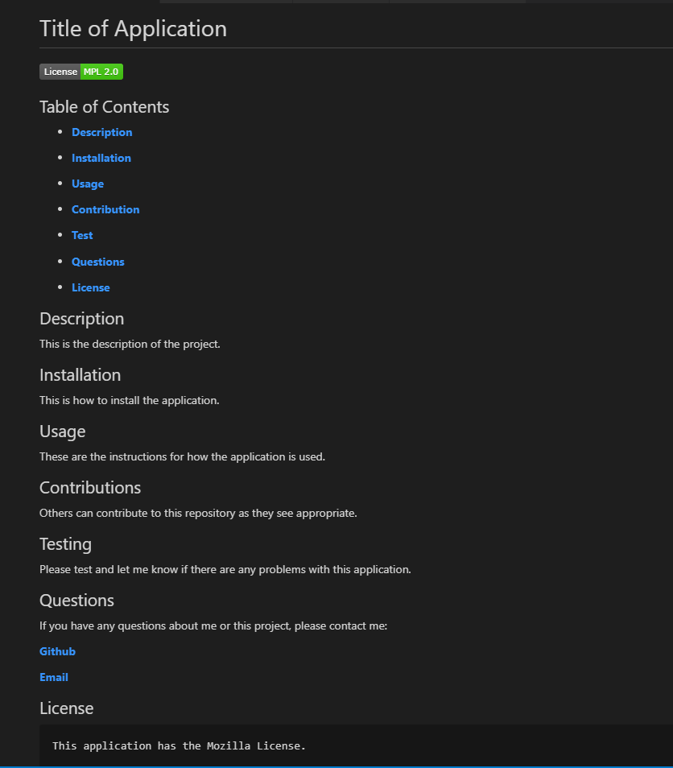
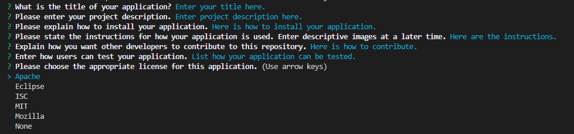

# Professional README.md Generator

## Technology Used 

| Technology Used         | Resource URL           | 
| ------------- |:-------------:| 
| JavaScript, nodejs, markdown | [https://choosealicense.com/licenses/](https://choosealicense.com/licenses/);  [https://docs.npmjs.com/about-npm](https://docs.npmjs.com/about-npm); [https://www.npmjs.com/package/inquirer](https://www.npmjs.com/package/inquirer); [https://nodejs.org/en](https://nodejs.org/en); [https://www.markdownguide.org/cheat-sheet/](https://www.markdownguide.org/cheat-sheet/);

## Description 

This application will produce a high-quality, professional README.md with the title of your project and sections for Description, Table of Contents, Installation, Usage, License, Constributing, Tests, and Questions. By following the prompts and adding the requested information, all the appropriate sections will be written into the appropriate file format and populate the above-stated sections. Additionally, the application gives you a list of licenses to choose from and displays the associated badge and license name.

[Google Drive Link to see the Professional README.md Generator in action!] (https://www.veed.io/view/9ca75528-8ef9-47bb-80e3-8674a1d29cef?panel=share)

Here is a screenshot of the README.md file that is generated by this application:

## Installation

The application can be installed by using the repository link [here](https://github.com/tdusenbury/Professional-README-Generator) and cloning down to your local computer. 
When the application is loaded on your computer, navigate to the root folder and run `init i` to install the correct version of the dependencies.

## Screenshots

Here are some of the questions you will be answered and a list of the license options:

## Usage 

This is a great tool for creating a README.md file quickly and easily making. Once installed, open the terminal and run `node index.js`. The user then answers the prompted questions. Once completed, the `README1.md` file is generated.

## Credits

Shout outs to Laurie, Cassie, Afi, Liubov, Kakazi, Bahareh, Victoria, my tutor Katie, the Cohort TA's, and Jerome for your patience and support.

## License

This application has an MIT License.

Copyright (c) 2023 tdusenbury

## Author Info

TAMARA "T" DUSENBURY

    I am excited to take my knowledge of various industries into the virtual realm.

